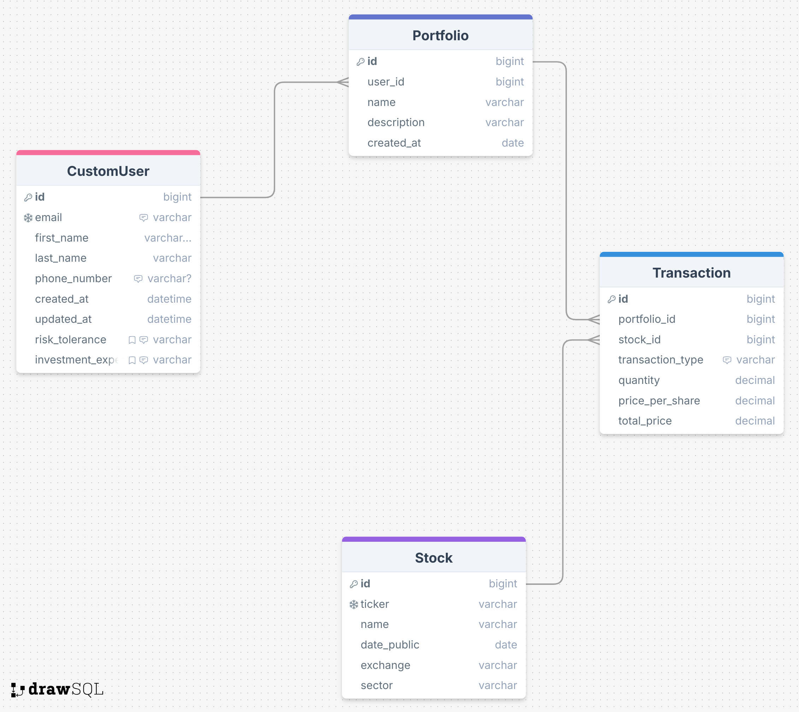

#### Minimum Viable Product user stories
- user should have the ability to make a stock portfolio, 
- add stocks to their portfolio
- display charts detailing stock info, plus advanced data on stocks
- user should be able to see advanced metrics on the entirety of their portfolio
- user should be able to interact with mostly customized buttons and features that are reminiscent of an older time
### User Info
- user: cw2, email:bob@yahoo.com, ps: FreakNasty
### Personal Project!

- feels huge in scope
- googleoauth, iffy, easier to do basic authentication/login form maybe....
- make users, linked to porfolios, quantity of stocks, 
- django will talk to db
- scrape data from twitter, reddit, finance forums
- use llm, model to analyze said data, form sentiment score
- use API calls to provide porfolio analysis
- allow users to add, sell, change amounts of stock owned.
- right bar displays quick access to several news sources: hackernews, wall street journal, tldr, also find a way to pull hot topics?? Word on the street, recent hot news section vs. important news. three sections of: first, Important, huge headlines, scrape real time hot news, and pull/have links to my trusted sources.
- IPO calendar option too?
-finbert vs finnhub
-charts.js

To Do: 
Setup vercel + heroku conversation, basic homepage, perhaps auth capabilities + login. Database switching depending on local dev or deployment, maybe CI/CD too(tommorrow problem)..
7/30

07/29 morning: Heroku deployment setup properly, allowed hosts configured, now can setup views, create database schema.

08/05 New updates and roadmap. Created vercel application, now can begin to connect frontend to backend which will probably be pretty tricky. Couples ways I could go this afternoon. Maybe some design stuff in figma, maybe more backend with stocks, api calls, etc, or could build out a basic frontend page to handle initial login.
# Possible Roadmap (Changes possible)
Day 1-2: Project Setup + Auth System
✅ Set up your project structure:

Backend (e.g., Django, Flask, FastAPI)

Frontend (React or another JS framework)

PostgreSQL or SQLite for dev

✅ Set up user authentication (JWT or session-based)

Registration/Login/Logout

User model with email/password

✅ Use environment variables for secrets (e.g., .env)

Day 3-4: Stock Data Ingestion
✅ Choose a stock data source (e.g., Yahoo Finance, Alpha Vantage, Finnhub)

Build utility functions or a service module to query stock prices, company info, etc.

✅ Implement a scheduler (e.g., Celery + Redis, or cron job) for periodic updates

✅ Store stock data in your database:

Tickers, historical prices, meta info

Day 5: Database Models & APIs
✅ Models:

Stock: Ticker, name, etc.

StockPrice: Date, Open, Close, Volume

UserStock: FK to user + FK to stock, quantity, buy price

✅ Build APIs:

Get all available stocks

Get details for a single stock

Add/remove a stock to a user's portfolio

Day 6-7: Portfolio API & Frontend Scaffolding
✅ API:

Get user's current portfolio (with current vs buy prices)

Compute metrics (e.g., total value, gains/losses, diversification)

✅ Start frontend with authentication and protected routes

Use JWT/localStorage

Basic dashboard: List stocks, view details, add to portfolio

🗓 Week 2 – Portfolio Analysis, UI, and Polish
Day 8-9: Portfolio Analysis Features
✅ Calculate metrics:

% returns, average return, risk (std dev), diversification

Use pandas or numpy if needed

✅ Chart data:

Line charts for price history

Pie chart for portfolio allocation

Day 10-11: Frontend Display
✅ Build portfolio dashboard:

Show each stock's info

Gain/loss per stock and overall

Charts using libraries like Chart.js or Recharts

✅ Add filters/search for stocks

Day 12: Error Handling & Testing
✅ Handle common errors (e.g., API limits, invalid tickers)

✅ Write unit tests for backend logic

✅ Test auth and edge cases (unauthorized access, bad inputs)

Day 13: Deployment Prep
✅ Dockerize backend

✅ Set up .env, production database configs

✅ Deploy to Render, Railway, or Heroku (or your preferred host)

✅ Optional: CI/CD pipeline (GitHub Actions)

Day 14: Final Polish
✅ UI polish (dark mode, loading states, responsive)

✅ README with setup instructions

✅ Short demo video/gif if showcasing

# Source Material:
[Insider Sentiment Finnhub](https://finnhub.io/docs/api/insider-sentiment) 

[Hugging Face Finbert](https://huggingface.co/ProsusAI/finbert)

[Portfolio Optimizer API](https://portfoliooptimizer.io/)

# Models: 

